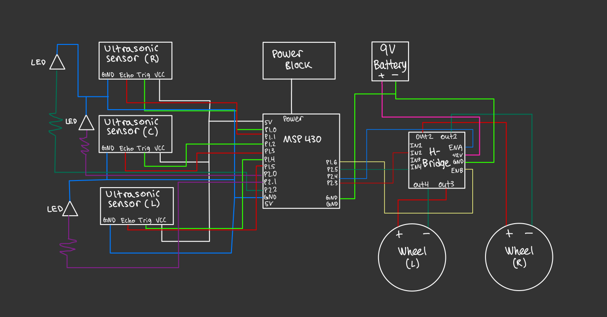

# Group 16's ELEC 327 Final Project: FrenBot
This repository contains the software to run Frenbot, a hand-following robot. A link to our pitch video can be found here: https://rice.app.box.com/file/1514839645453.

## Description
Frenbot is made of a 3-wheel base (2 motors and 1 free-pivot) and a 3-sensor array of ultrasonic HC-SR04 sensors. Sensors detect obstacles (e.g. hand) at a preset distance and move according to which sensor detects an obstacle. The front sensor triggers forward movement, and the right and left trigger robot turning. If the sensors detect that an object is too close to Frenbot, it will stop. 

### Software Architecture
The system works in a fast loop of measuring distance from the 3 sensors. After measurement, an if-else block sets and clears flags according to the distance of a sensor to an obstacle (e.g. if front sensor is <20cm from an obstacle, it moves forward). Turning takes priority over moving forward. Frenbot does not move if both turning sensors is sensing a close obstacle. A function after the if-else block sets the speed of the motors using Pulse-Width Modulation based on the flags set/cleared prior.

### Hardware Architecture
3 ultrasonic sensors are placed in a curved array at the front of the motored wheelbase. All input/output pins of the sensors and 2 DC motors are connected to a single launchpad. Additionally, LED pins following the setting/clearing of flags serve as visual indicators.

### Materials
* 1 MSP430G2553 LaunchPad
* 2 DC motors with H-bridge
* 1 free-pivot wheel
* 3 HC-SR04 ultrasonic sensors
* LED pins
* Wires

## Authors
* Agha Sukerim (ads13)
* Ben Wilson (bjw8)
* Ithzel Toscano (ijt2)
